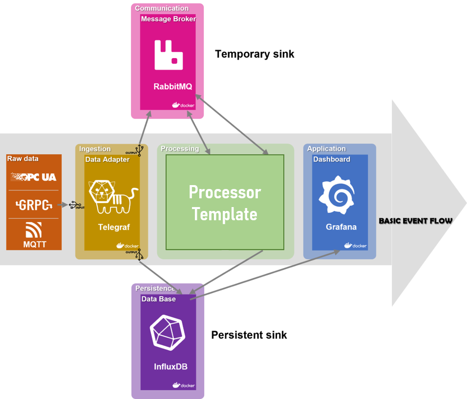
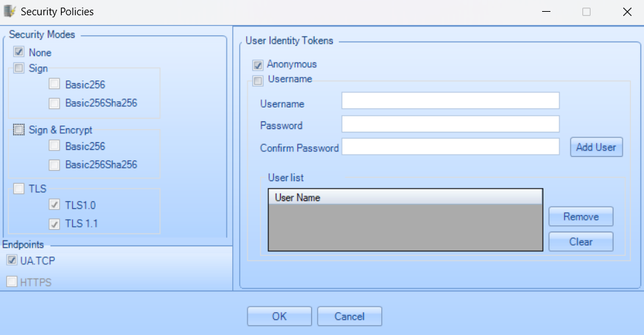
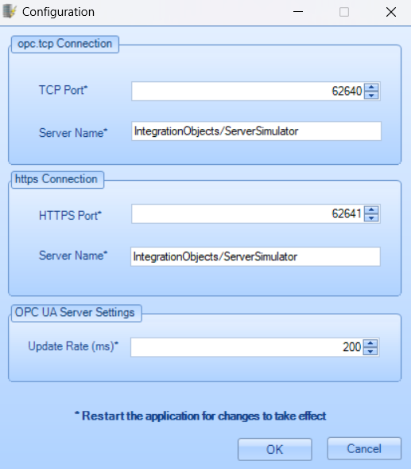

# MLDeploy
## Introduction
*MLDeploy* is a concept for a universally applicable deployment of ML models with continual validity in machine tools. It belongs to the research project *AutoLern*. This deployment provides a simple solution to the machine learning analysis of the real-time recorded data by applying the ML module. This solution supports a profound range of data sources such as *OPCUA*, *gRPC*, *MQTT*, etc. *MLDeploy* also provides the visualization and alarm notification of the analysis results.

*MLDeploy* supports the development of components *preprocessor* and *modelserver* inside a container in *VSCode* (*Dev-Container*). It allows the developers to open any folder inside (or mounted into) a container and take advantage of Visual Studio Code's full feature set.

Details are written in the *User Manual*.

## Architecture of framework
The following figure shows the framework. All of the components run in containers, which provides an isolation environment from the operating system.



- *Raw Data*

    provides input data from a server. Currently supported servers are the *Arburg-OPCUA* server, *Arburg-gRPC* server and *ControllerSim-MQTT* server.

- *Telegraf*

    is an agent, developed *InfluxData*, which collects incoming data from *Data Source* via
    
    **input-plugins** such as *opcua* (on-premise), *mqtt* (on-premise) and *arburg-grpc* (self-written)
    
    and subsequently sends data in certain data format such as *influx* via 
    
    **output-plugins** such as *influx* (on-premise) and *rabbitmq* (self-written).

    **Hint**: The input-plugin *MQTT* works only when the message broker *Mosquitto* is also running in the background. So does the output-plugin *rabbitmq* when *RabbitMQ* is running.

- *RabbitMQ* 

    broker is a mesage broker implementing AMQP and it receives messages from *AMQP* (*RabbitMQ*) clients and routes messages to the appropriate subscribing clients. 
    
    Here, *RabbitMQ* receives messages from several clients such as *RabbitMQ* output-plugin of *Platform* with *exchanger=input* and the publisher in *Preprocessor* of *Hut* with *exchanger=preprocessor* and routes the data to the subscriber in *Preprocessor* of *Hut* and the subscriber in *Modelserver* respectively.

- *InfluxDB*

    is an open-source time series database developed by *InfluxData* for storage and retrieval of time series data in fields. 
    
    Here, it stores data sent by *Telegraf* output plugin *influxdb* (*databse=input*) and the *influxdb* client of in *Modelserver* (*database=predictions*). Then, the visualization tools *Chronograf* and *Grafana* retrives data from *InfluxDB*.

- *Preprocessor*

    is written in *python* and interpolates the time-stamped input data obtained by *RabbitMQ* subscriber (*exchanger=input*) with evenly distrubited timestamp intervals in each time frame and sends them again via *RabbitMQ* publisher (*exchanger=proprocessor*) for subsequent analysis by *Modelserver*.

- *Modelserver*

    is written in *python* which produces the construction loss between the preprocessed input data obtained by *RabitMQ* subscriber (*exchanger=proprocessor*) and the prediction by the autoencoder and stores the data to *InfluxDB* by an *influxdb* client (*database=predictions*).

- *Grafana*

    is a multi-platform open source analytics and interactive visualization web application. It not only visualizes the input data from *Data Source* and the construction loss obtained by *Modelserver* but also send alarms via E-mails to users when the construction loss exceeds a certain value.


## Structure of repository
```
project
|   start.bat
|   compose.yaml
|   .env
|   ...
└───docker-volumes
|   |   ...
└───components
|   |   grafana
|   |   influxdb
|   |   modelserver
|   |   preprocessor
|   |   rabbitmq
|   |   telegraf
└───external
    |...
└───lib
    |...
```
## Run Demo in Windows
- Sine Wave Simulator
    - Clone the "ML-Deploy" repository of branch "sine_wave_simulator" by entering the command
        ```bash
        git clone--branch sine_wave_simulator https://hub.autolern.org/wbk/MLDeploy.git
        ```
    - Navigate to the repository external/controllersim and open a command window at this path.
    - Create a virtual environment at this path according the Pipfile by entering the command
        ```bash
        pipenv shell
        ```
    - Change directory to external/controllersim/app by entering the command
        ```
        cd app
        ```
    - Run the sine wave simulator by executing the main.py file by entering the command
        ```bash
        python -m main
        ```
    - Start the Docker Engine
    - Open a command window at the root path of the project and enter the following command to start the ML-Deployment
        ```bash
        ./start
        ```
    - Open the Grafana dashboard by entering "localhost:3000" in the browser
    - The default username and the password are both "admin"
- Arburg Freeformer using OPC UA Server Simulator
    - Clone the "ML-Deploy" repository of branch "arburg" by entering the command
        ```bash
        git clone --branch arburg https://hub.autolern.org/wbk/MLDeploy.git
        ```
    - Download OPC UA Server Simulator under https://integrationobjects.com/sioth-opc/sioth-opc-unified-architecture/opc-ua-server-simulator/
    - Move the files containing the simulated data ValueSpace.csv and AddressSpace.csv from the repository external/arburg to the destination repository. It is usually
        ```
        C:\Program Files\Integration Objects\Integration Objects' OPC UA Server Simulator\DATA
        ```
    - Open the OPC UA Server Simulator and configure the Security Policies and Configuration under Settings as below:
        

        
    - Restart the OPC UA Server Simulator in order to bring the configuration into effect
    - Start the Docker Engine
    - Open a command window at the root path of the project and enter the following command to start the ML-Deployment
        ```bash
        ./start
        ```
    - Open the Grafana dashboard by entering "localhost:3000" in the browser
    - The default username and the password are both "admin"